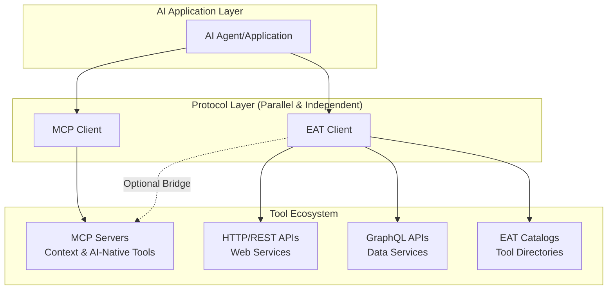

# EAT Framework - Ephemeral Agent Toolkit

[](https://www.python.org/downloads/)
[](https://opensource.org/licenses/MIT)
[](https://github.com/foofork/eat/actions)

**One-hop tool discovery for AI agents (and humans) using signed .well-known catalogs**

Most people know MCP for connecting AI agents to third-party tools, but there's an elegant approach using signed .well-known catalogs that lets anyone - agents, developers, or automation scripts - discover your entire internal tool ecosystem in a single hop.

## 🎯 Who It's For

- **AI Agents**: Autonomous tool discovery and intelligent selection
- **Developers**: Quick discovery of internal APIs and services  
- **DevOps Teams**: Simplified tool inventory and automation
- **Organizations**: Scalable tool ecosystems without complex registries

## 🤔 The Problem

Organizations have hundreds of internal tools (APIs, MCP servers, services) but:
- **AI agents** can't find or use them effectively
- **Developers** waste time hunting for the right API
- **Tool sprawl** grows faster than documentation
- **Complex registries** become bottlenecks and single points of failure

## 💡 The Solution

Drop one signed file at `/.well-known/api-catalog` and everyone discovers your tools instantly:
- **One HTTP GET** replaces complex service discovery
- **Complete usage context** - auth, examples, error patterns  
- **Cryptographically signed** for security and integrity
- **Human + AI readable** - same catalog, different interfaces

## Protocol Architecture: EAT and MCP as Complementary Systems

### Critical Architectural Distinction

**EAT and MCP are peer protocols, not hierarchical.** This is a fundamental design principle that applies universally across all platforms:

#### **The Correct Pattern: Parallel Protocol Integration**



## 🚀 Quick Start

### Try the Demo (2 minutes)
```bash
git clone https://github.com/foofork/eat.git
cd eat/demo && ./quickstart.sh
open http://localhost:8000  # Interactive catalog browser
```

### Use in Python
```python
import asyncio
from eat import Catalog

async def main():
    catalog = Catalog("http://localhost:8000/.well-known/api-catalog")
    await catalog.fetch()
    
    # Find and use a tool
    tool = catalog.find(capability="customer")[0]
    result = await tool.call(customer_id=12345)
    print(f"Customer: {result['name']}")

asyncio.run(main())
```

### Install the Package
```bash
pip install -e .
```

## ⚡ Key Features

- **🔍 One-hop discovery** - Find all tools from a single catalog URL
- **🔐 Cryptographically secure** - JWS signatures with content verification
- **📋 Standards-based** - Built on OpenAPI, RFC 8615, and MCP
- **🚀 Zero infrastructure** - Just static files, no registries
- **🏗️ Complete demo** - Working environment with 3 realistic MCP servers

## 🏗️ What's Included

### Demo Environment
- **3 MCP Servers**: Customer management, Analytics, Notifications
- **13 Production Tools**: Complete business workflow examples
- **Interactive Browser**: Visual catalog exploration at `localhost:8000`
- **Example Agents**: Simple and multi-tool workflow demos

### Documentation
- **[QUICKSTART.md](QUICKSTART.md)** - 10-minute implementation guide
- **[PROTOCOL.md](PROTOCOL.md)** - Complete protocol specification
- **[docs/](docs/)** - Architecture, security, deployment guides

### Examples
- **Python client** - Full implementation in 50 lines
- **curl scripts** - Pure HTTP examples
- **OpenAPI specs** - Real-world API definitions with `x-mcp-tool`

## 🎯 Demo Tools

The included demo showcases realistic business tools:

| Service | Port | Tools |
|---------|------|-------|
| **Customer** | 3001 | `list_customers`, `get_customer`, `create_customer`, `update_customer`, `delete_customer` |
| **Analytics** | 3002 | `get_dashboard_metrics`, `generate_analytics_report`, `track_custom_metric` |
| **Notifications** | 3003 | `send_notification`, `send_bulk_notifications`, `get_notification_status`, `list_templates` |

## 💡 Language Examples

### Python (Built-in)
```python
from eat import Catalog

catalog = Catalog("http://localhost:8000/.well-known/api-catalog")
await catalog.fetch()
tools = catalog.find(capability="customer-management")
result = await tools[0].call(customer_id=1)
```

### curl (Any Language)
```bash
# Discover tools
curl http://localhost:8000/.well-known/api-catalog | jq '.tools[].name'

# Call a tool
curl -X POST http://localhost:3001 \
  -d '{"jsonrpc":"2.0","method":"tools/call","params":{"name":"get_customer","arguments":{"customer_id":1}}}'
```

## 🔧 Development

### Run Tests
```bash
pip install -r requirements-dev.txt
pytest tests/ -v
```

### CLI Tools
```bash
# Generate catalog from specs
python -m eat.cli.main generate specs/ --output catalog.json

# Serve locally
python -m eat.cli.main serve --port 8000
```

## 📁 Repository Structure

```
eat/
├── README.md                   # This file
├── QUICKSTART.md              # 10-minute tutorial
├── PROTOCOL.md                # Complete protocol spec
├── eat/                       # Python package
├── demo/                      # Working demo environment
├── examples/                  # Implementation examples
├── docs/                      # Complete documentation
└── tests/                     # Test suite
```

## 🤝 Contributing

Contributions welcome! Areas for enhancement:

- Additional language implementations (Go, Rust, JavaScript)
- More MCP server examples  
- Enhanced security features
- Performance optimizations

See [docs/](docs/) for detailed guides.

## 📄 License

MIT License - see [LICENSE](LICENSE) for details.

## 🚀 Get Started

| I want to... | Start here |
|--------------|------------|
| **Try the demo** | `cd demo && ./quickstart.sh` |
| **Implement EAT** | [QUICKSTART.md](QUICKSTART.md) |
| **Read the protocol** | [PROTOCOL.md](PROTOCOL.md) |
| **See examples** | [examples/](examples/) |
| **Production deployment** | [docs/deployment.md](docs/deployment.md) |

**Ready to give your AI agents one-hop tool discovery?** Start with the [10-minute tutorial](QUICKSTART.md)!